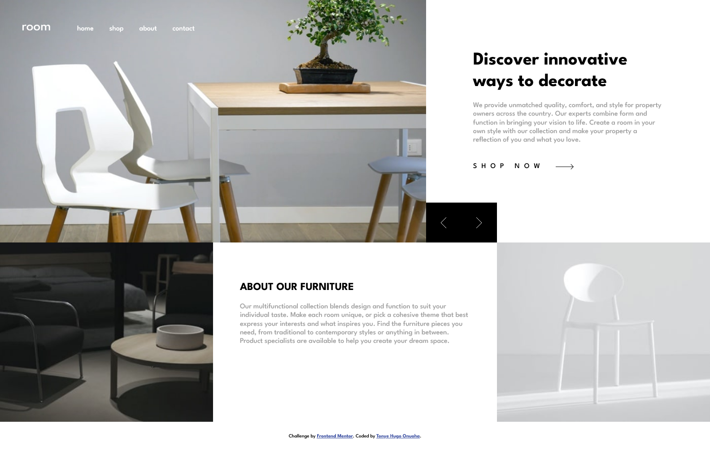

# Frontend Mentor - Room homepage solution

This is a solution to the
[Room homepage challenge on Frontend Mentor](https://www.frontendmentor.io/challenges/room-homepage-BtdBY_ENq). Frontend
Mentor challenges help you improve your coding skills by building realistic projects.

## Table of contents

- [Overview](#overview)
  - [Screenshot](#screenshot)
  - [Links](#links)
- [My process](#my-process)
  - [Built with](#built-with)
  - [Useful resources](#useful-resources)
- [Author](#author)

## Overview

This is an HTML, CSS, and JS project in which the main objective is to build out a "Room homepage" web-page.

### Screenshot

### Links

- Live Site URL: [Vercel]()

## My process

The process was very straightforward. I started by writing out the stucture of my HTML. I then created a CSS stylesheet
and broke down the styling of elements one piece at a time using the flexbox and grid layout model, while following the
mobile-first approach. To complete the layout, I then proceeded to write the media queries for the desktop design. After
the design was completed, I proceeded to add the logic and interactivity of the page using JavaScript.

### Built with

- Semantic HTML5 markup
- CSS custom properties
- Flexbox layout model
- Grid layout model
- Media queries

### Useful resources

- [W3Schools](https://www.w3schools.com/)

## Author

- Email Address - [tonyeonuoha@gmail.com](tonyeonuoha@gmail.com)
